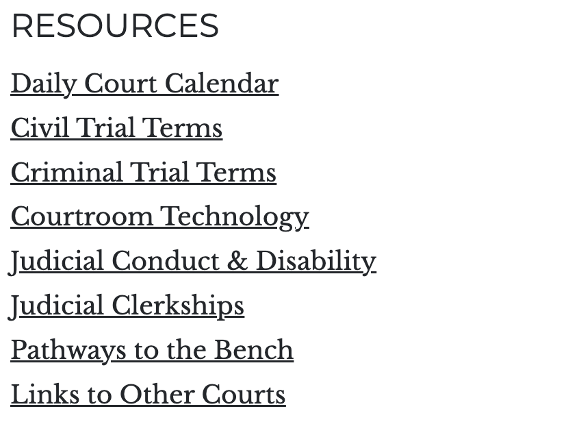

# Article list

Article lists are a great way to collect a list of article links and place them anywhere on your pages. The list is made up of a title for the list, and a series of individual links to mostly internal articles but also external pages. You can add as many links as you wish to a list of articles, but it's a good practice to keep the list relatively short to avoide extra long lists on your pages.

## Creating an Article list

An Article list can be added to the main content of the page as well as the sidebar. The main difference between the Article list and Quicklinks is the title of the lists. The quiclinks offer a styled titlte with a dark background, whereas the article list is a simple text without any styles.

1. While on any page where you wish to add the Article list, click the **Edit** tab to begin the editing process.
1. Once you are in the edit screen, click the **Add component** button.
1. In the **List** category you should see the **Article list** component, click on it to add it to the page
1. Next, you need to provide the title for the list. For example, "Our resources"
1. Provide a URL for the link. Remember, the URL can be an internal page or external page
1. Type the label for the link. This completes the process for the first link.

Since this is a list of links, the next step is to click **Add another item**. This will allow you to add more links to the same list. Repeat the process until you have added all the links you wanted in the list.

Finally, click **Save** to save the page with your list.
