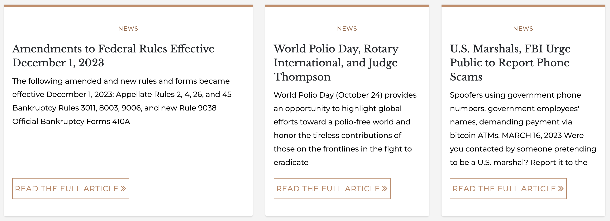

# Card notice set

It is very common for websites to have a section on their homepage for what is known as "Featured content". This is the latest content or content that needs to be called out because of its nature of important. The Card notice set is the perfect component to use for these situations.

The fields that make up the set of notices include:

* `title`: This is the title for the entire collection. Something like _Featured content_.
* `notice`: The is an autofill field which will provide a list of articles to choose from based on what you type in the field.

## Creating a Notice set

1. While on any page where you wish to add a quote, click the **Edit** tab to begin the editing process.
1. Once you are in the edit screen, click the **Add component** button.
1. In the **Content** category you should see the **Card notice set** component, click on it to add it to the page
1. The **Title** field is for the entire collection of notices.
1. In the **Notice** field, begin typing the title of the article you wish to add and you should get a list of options to pick from. Once you see the article you are looking for, select it.
1. To add another article, click the **Add another notice** button.
1. Repeat step 5 for each article you wish to add. You can add up to 3 articles.

Once you have completed adding all the articles you want, click the **Save** button to save the page.

### Tip

Just like you can reorganize components by dragging the cross-air icon, you can do the same with the articles in this set.
