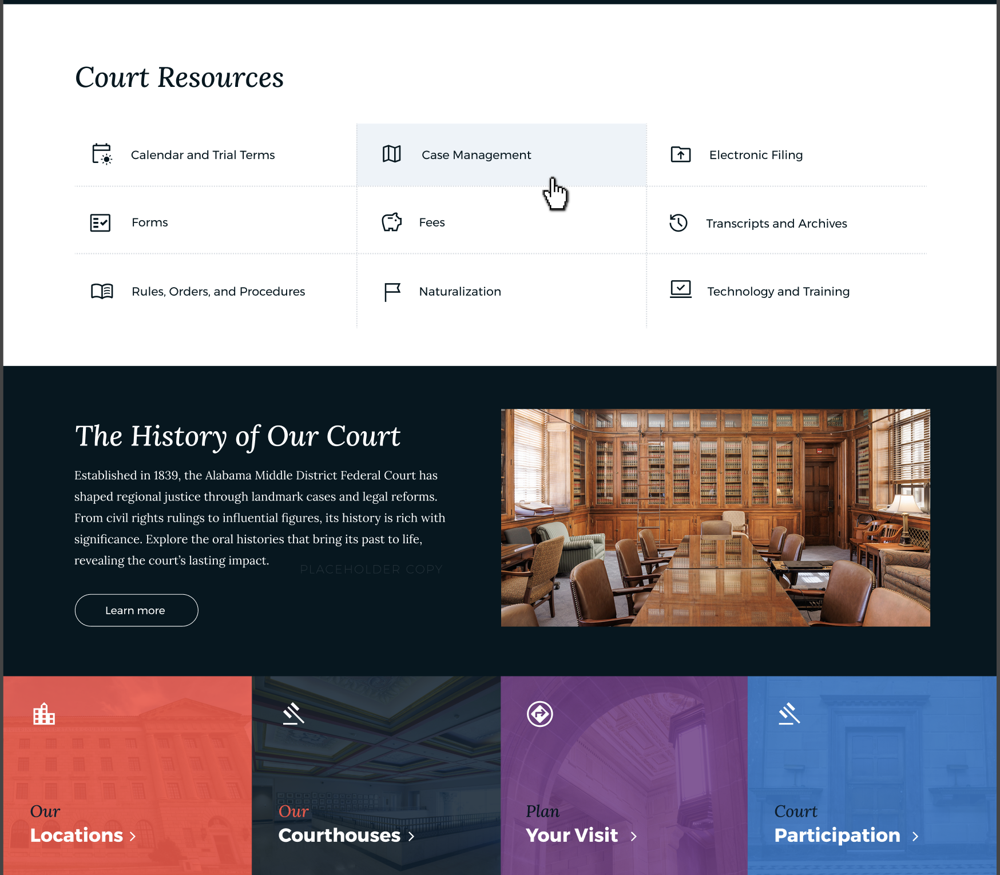
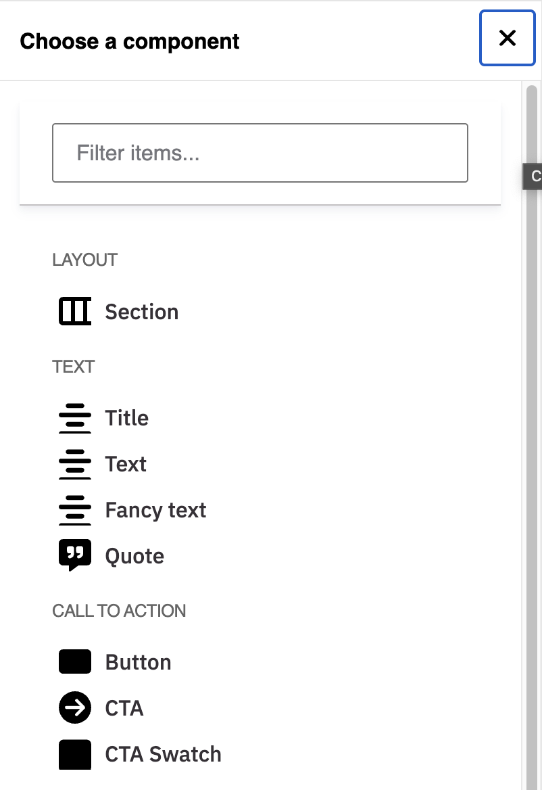

# Components

Components are the building blocks of the website. They are reusable and provide several customization options so they can adapt to different use cases.
A component can be as small as a button or link, and big like the entire section of a page.

_FIG. 1. Visual example of a page using component._

Each component has been built to perform a specific function which means each component is unique. However, some components are flexible or general enough that could be used in different use cases.

**Available components**: Click the [Design System](https://govbydesign.github.io/almd-storybook/) link at the top of this guide for a full list of available components.

## Adding components to a page

Adding a component to a page is a pretty straight forward process but it requires a good understanding of the content you are about to add and known the best component for the job.

1. First step, [add or edit a layout section](../content/section.md).
1. After adding or editing a section, hover over the section and click the _plus_ ( + ) sign in the column you wish to add content to. The **Choose a component** dialog will display.
1. The components in the _Choose a component_ dialog are organized in categories such as Text, Call to action, Media, Cards, and Content list. See FIG. 2. below.
1. Click the component you wish to add. Depending on the component, you will be prompted with fields to fill out.
1. Each component has a set of customization options or styles. You can find these by clicking the **Styles** tab while editing the component. Styles you could expect to see on components include:
    * Top/Bottom margin
    * Top/Bottom padding
    * Background color
    * Alignment settings
    * Text color or text size, and others.
1. Once all fields are filled out and the style options are set, click **Save** to close the component edit dialog.
1. Click the **Save** button at the top of the screen, then click **Done**. You should see your component displayed on the page.

_FIG. 2: List of component to choose from._
