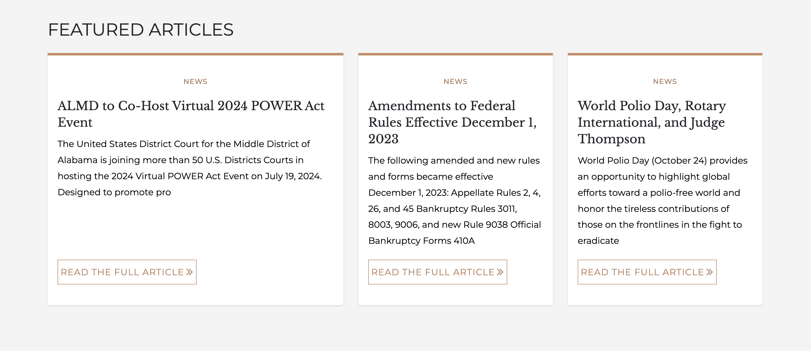

# Content list

The Content List component is great to showcase articles that are relevant to the audience of the site or a specific page. The content list component allows content managers to hand-pick articles of type News or Procedures to display in a card format.

<figure><figcaption>
Featured content as content list
</figcaption></figure>

Let's say we have a Human Resources pages, we can add a Content List component where we can call out the top 3 articles that are important to visitors of the page to see. Each section of articles can have a unique heading such as **Featured content, Important Articles, Latest Procedures,** etc.

In addition, there is no limit on how many of these sections you can display on a given page. You can have multiple sections of articles each of which would be labeled with a unique heading.

### Creating a Content list

1. While on any page where you wish to add the Content list, click the **Edit** tab to begin the editing process.
2. Once you are in the edit screen, click the **Add component** button.
3. From the **Media** category, click the **Hero** component. You should be presented with several fields. As previously indicated, the only field we use is the **Image** field. The rest are ignored.
4. Click the **Add media** button and select one or more images yo uwish to be part of your Hero component.
5. Press **Insert selected**
6. Press the **Save** button to save the page.

