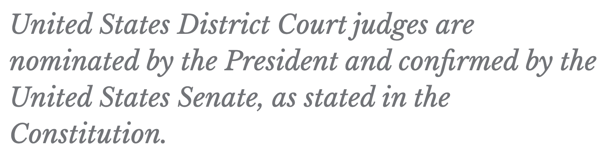

# Custom text

The Custom text component is similar to the Quote component in that they both look nicely styled and stand out from all other regular text.

The purpose of the Custom text is to callout specific text from the rest of the page's text. Usually you can use the custom text as an introduction to a page.

The fields that make up the Custom text include:

* `text`: This is the field where the text you wish to display on a page is entered.
* `color`: Users have three options to choose from for text color: **Gray**, **Light gray**, and **Gold**.
* `size`: The size of the text can be adjusted by selecting either **Small**, **Medium**, and **Large**.

## Creating a Custom text component

Similarly to the quote component, you can add the custom text anywhere within a page or section of the site.

1. While on any page where you wish to add a custom text, click the **Edit** tab to begin the editing process.
1. Once you are in the edit screen, click the **Add component** button.
1. Depending where in the page you are adding the custom text (main content, sidebar, etc.), the Add component dialog window may display different available components. The custom text component can be found in the **Content** category of the dialog box. Once you find it, click on it to add it.
1. The Custom text provides the **Text** field for you to type any text you wish to display as custom.
1. Next, you can select the color of the text from the list provided.
1. Finally, you can select the size of the text from the provided list of different sizes.
1. Once all the fields have been interacted with, press the **Save** button.

You should see the new custom text displayed on the page.
