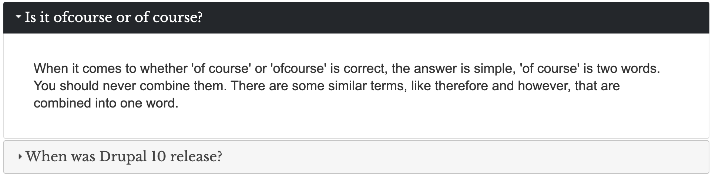

# Frequently asked questions

Frequently asked questions or FAQ, are essential on sites that provide products or services. The site provides a FAQ system which is integrated to several content types meaning that if you create for example a basic page, you will see at the end of the page the option to add FAQs and they will be displayed at the bottom of the page below all other content on the page.

Alternatively, you can create a page expecifically to store all FAQs for your site. Regardless of how you wish to create them, the FAQs creation process is the same.

Fields for the FAQ system:

* `question`: This is where you type the question
* `answer`: The space for typing the answer to the question

## Creating FAQs

Whether is a dedicated page for FAQs or adding them to a random page, follow these instructions:

1. While on a page where you wish to add FAQs, click the **Edit** tab to begin the editing process.
1. Scroll to the bottom of the page and you should see the **Frequently Asked Questions** section.
1. Type the Question you wish to add along with the answer.
1. If you wish to add more, press the **Add another item** button and you will be prompted with the same two fields again.
1. Repeat this process to add as many FAQs as you with.
1. When you are done, press the **Save** button.
1. One last thing, if you wish to reorder the FAQS, you can rearange them by dragging the cross-air icon to the left of each FAQ and move it to the order you wish to display them.

You should see all the FAQs you added at the bottom of the page.
