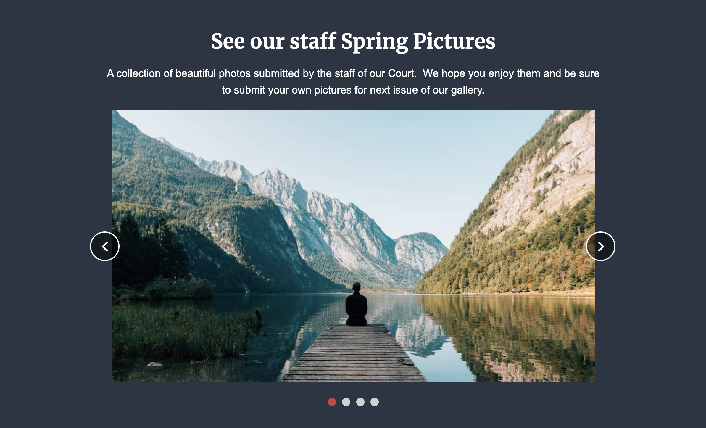

# Galleries

Nothing enhances the look of a page like images do.  There are two great Gallery options to choose from and each of them have unique features.

### Images only

* This gallery allows you to add as many images as you wish and it will present them as a slider which visitors can cycle/loop through endlessly.
* This gallery provides an optional field for a title of the entire gallery, as well as a description of the entire gallery.  See example below.
* This gallery is perfect for when all is needed is for images to be looked at and a description of each image is not required.  For example, Holiday party, employee event, etc.

### Gallery with images text

* This one is different than the one above, this gallery allows content managers to add as many images as needed, but each image may have its own title and text. &#x20;
* This gallery is great when content managers need to describe each image for added context.
* The slider loops through all images indefinitely.

