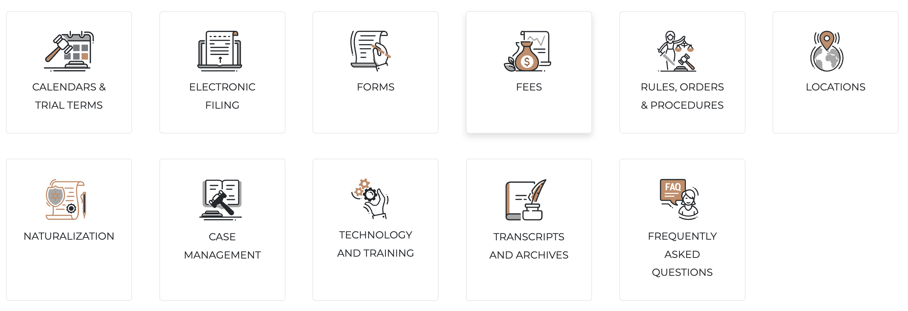

# Icon card set

The site provides a series of resources that if not handled properly could get out of hand. For this reason we created the Icon Cards, in which each icon represents the kind of resources you are linking to as well as a short label that describes the resource. Creating a single card on its own makes no sense, therefore we created the **Icon card set**, which is a collection of these cards that together are called **Resources**.

The fields that make up the set of cards include:

* `title`: This is the title for the entire collection. Something like _Resources_.
* `icon`: This is a curated list to choose from for the type of card you are creating. A predefined list of icons is already in place which means you can only select from the list.
* `URL`: The link you wish to direct your visitors to when they click the card. As mentioned in other components, the link can be  internal or external.
* `link text`: The short label you wish to add below the icon. For example: _Locations_, _Fees_, _Electronic filing_, etc. Something short so it fits within the card.

## Creating a Card set

1. While on any page where you wish to add a quote, click the **Edit** tab to begin the editing process.
1. Once you are in the edit screen, click the **Add component** button.
1. In the **List** category you should see the **Icon card set** component, click on it to add it to the page
1. The **Title** field is for the entire collection of cards
1. Fill out the **URL** and **Text link** fields. Remember, if you are linking to an internal page (A page that already exists in your site), you simply start typing the title of the page (or part of the title), and you will see a list of suggestions to pick from. If you need to link to an external site, type the full address of the site (i.e. https://google.com).

This completes the addition of the first card. To add more cards, click the **Add icon card** button and then repeat step 5 above.

Once you have completed adding all the cards you want, click the **Save** to save the page.

### Tip

Just like you can reorganize components by dragging the cross-air icon, you can do the same with the cards to change the order in which each card will be displayed within the set.
