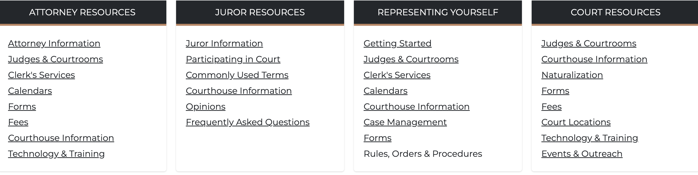

# Quicklinks set

Quicklinks are a very important and common component found on most websites. For this site, we have the ability to create a single list of quicklinks, but we can also create a collection, or set of quicklinks lists. These collections are great for adding on the homepage or landing pages of your website.

The fields that make up the set of notices include:

* `title`: This is the title for the entire collection. Something like _Featured content_.
* `notice`: The is an autofill field which will provide a list of articles to choose from based on what you type in the field.

## Creating a Quicklinks set

1. While on any page where you wish to add the Set of Quicklinks, click the **Edit** tab to begin the editing process.
1. Once you are in the edit screen, click the **Add component** button.
1. In the **List** category you should see the **Quicklinks set** component, click on it to add it to the page
1. The **Title** field is the title for the entire set. For example, "See more more resources"
1. Next, you need to provide the title to one of the individual lists. For example, "Our locations"
1. Provide a URL for the first link. Remember, the URL can be an internal page or external page
1. Type the label for the link. Regardless of the link URL, you can call the link something like "Headquaters division". This completes the first link for the first list.

Since this is a list of links, the next step is to click **Add another item**. This will allow you to add as many links to the same list.

You can follow the instructions for [Creating quicklinks](./quicklinks.md) for populating your list with links.

After completing the first list of links, you can add another list by clicking the **Add Quicklinks list**. Then repeat steps 5 through 7 above until you complete the second list of links. Repeat this process until you have added all the links to all the lists you need to create.

Finally, click **Save** to save the page with your links sets.
