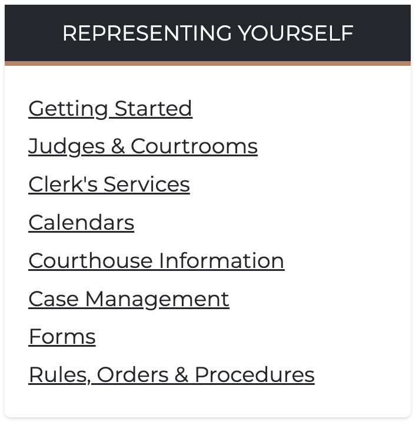

# Quicklinks

Quicklinks are a great way to collect a list of links to important pages or resources. The list is made up of a title for the list, and a series of individual links to either internal or external pages. You can add as many links as you wish to a list of Quicklinks, but it's a good practice to keep the list relatively short to avoide extra long lists on your pages.

## Creating Quicklinks

Quicklinks can be added to the main content of the page as well as the sidebar. In the main content, you can actually add multiple Quicklinks lists next to each other, see [Creating Quicklinks set](quicklinks-set.md) for the details, where as in the sidebar of the page, you can only add one list per row, but multiple stacked lists.

1. While on any page where you wish to add the list of Quicklinks, click the **Edit** tab to begin the editing process.
2. Once you are in the edit screen, click the **Add component** button.
3. In the **List** category you should see the **Quicklinks list** component, click on it to add it to the page
4. Next, you need to provide the title for the list. For example, "Representing yourself"
5. Provide a URL for the link. Remember, the URL can be an internal page or external page
6. Type the label for the link. Regardless of the link URL, you can call the link anything you want. This completes the process for the first link.

Since this is a list of links, the next step is to click **Add another item**. This will allow you to add more links to the same list. Repeat the process until you have added all the links you wanted.

Finally, click **Save** to save the page with your list.
