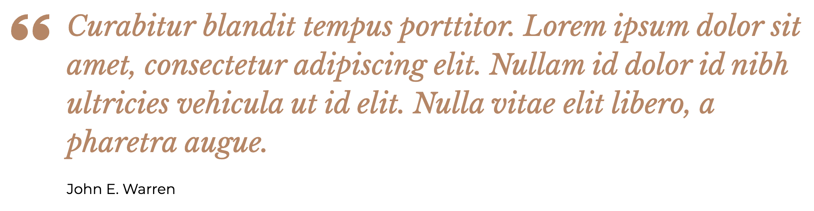

# Quote

Want to add a visual enhancement to your page?  a quote is a great way to do this.  With unique text styles, quotes are pieces of content that can improve the look and feel of any page.

The fields that make up the quote include:

* `quote`: The actual quote text.
* `quote author`: The name of the person by whom the quote was written.

## Creating a quote

Quote is a component that can be added virtually anywhere on a page.  Adding a quote to a page is a simple process:

1. While on any page where you wish to add a quote, click the **Edit** tab to begin the editing process.
1. Once you are in the edit screen, click the **Add component** button.
1. Depending where in the page you are adding the quote (main content, sidebar, etc.), the Add component dialog window may display different available components. The quote component can be found in the **Content** category of the dialog box. Once you find it, click on it to add it.
1. The quote only provides the Quote and Quote author fields. Fill out each of the fields and press the **Save** button.

You should see the new quote displayed on the page.
