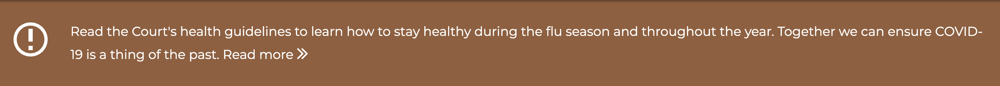
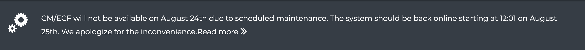
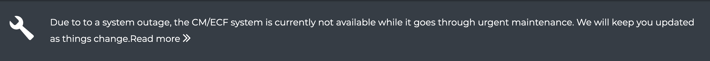

# Alert

Alerts are intended to display important and sometimes urgent messages your website visitors. The alert is displayed at the very top of the website and they are presented with different background colors. The background color depends on the type of alert. See below.

## Alerts types

Alerts are a great way to convery a message to visitors of something unusual or delicate they should be aware of. Using the same kind of alert for all situations looses the urgency a message may require. For this reason, we have color-coded various types of alerts to ensure they capture the attention of visitors.

### Information only alert

This is the most common alert which is used simply to inform your website visitors of upcoming or non-urgent changes or updates. The updates could include local rules changes, closing of your organization for observing of upcoming holiday, etc..

### Scheduled alert

If you know ahead of time that a critical computer system your visitors relay on, will need to be restarted or shutdown for a period of time due to schedule maintenance or a needed upgrade, this is the alert you need to use.

### Outage alert

This type of alert is as a response to an unplanned or unexpected system outage. It is to inform visitors that a critical computer system is unavailable for unknown reasons and that your team is working on restoring normal functionality.

### Emergency alert

This is the highest type of alert which informs visitors of a highly critical message such as active shooter, emergency shutdown of your institution due to potential danger, or an ongoing pandemic situation.

## Creating Alert messages


**IMPORTANT**: Ensure you are logged in with your own website credentials. You should have received separate instructions to login.


1. From your website's administrative toolbar (top of your site), click the **Content** link
2. Click the **Add content** button
3. Click **Alert** from the available options
4. The **Activate this alert** toggle allows you to turn the Alert on/off. In some cases you may have an alert that needs to be temporarily turned off. When you are ready to display it again, you turn it back on. Or, you may type an alert ahead of time and keep it off until is time to display it.
5. Fill-out the Title of the alert. This is a required field.
6. **Alert category:** Depending on the type of alert you are creating, select the corresponding category. The category determines the alert color as well as the degree of importance.
7. **Summary**: Since the space for the Alert is limited, the Summary field allows you to type a condensed version of the message. This message should be short but descriptive enough.
8. **Body**: This is where you can type a long description of the alert. Here you can add images and other HTML elements.
9. **Attachments:** If your alert has a supporting document to go with, like a PDF attachment, you can upload the document to it. So if a local rule changed, you could attached the updated version of the local rule in PDF format.
10. **Frequently Asked Questions**: If you want to be proactive and provide some FAQs you think visitors may have about this alert, you can do so here.
11. **Published**: Toggle this checkbox on/off depending on whether you want this alert to be available on the site or not. Regardless of whether it will show up at the top of the site, turn it the alert off will not make it searchable on the site.
12. Press **Save**

#### How to archive alerts?

When an alert is no longer needed to be displayed to visitors, you can archive it by turning the **Activate this alert** toggle off. The alert should no longer display however, it still exists in your system for archival purposes.

#### Viewing archived alerts

During and after an alert is published, you can visit your site's **/alerts** page to view a list of previously published alerts.
