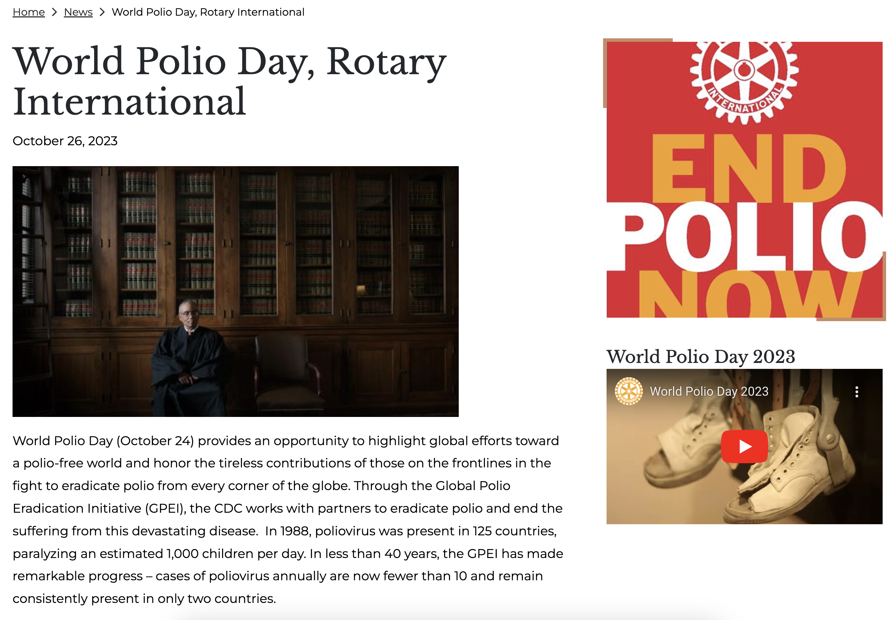
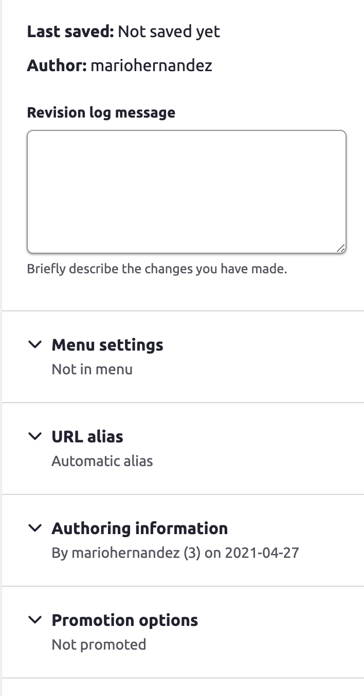
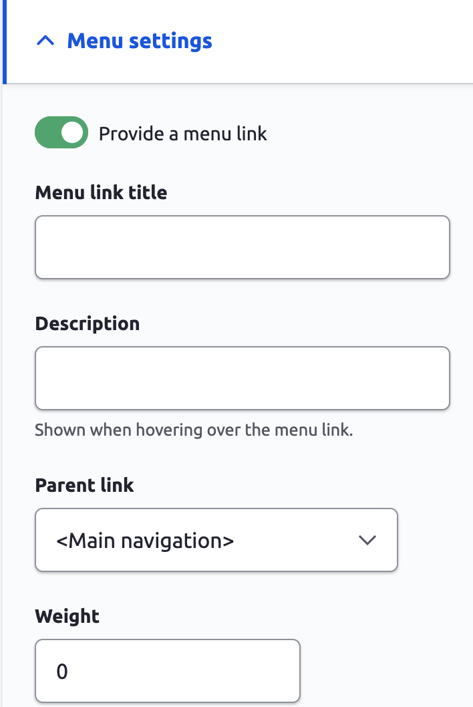
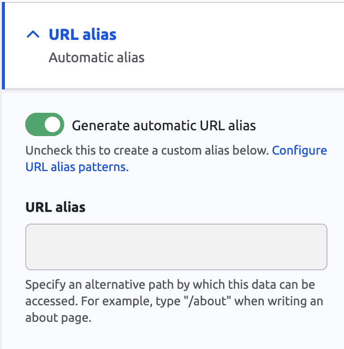

# News

News articles can be used for Notices, News, Memos, and Press releases

## Creating News Articles

1. From your website's administrative toolbar (top of your site), click the **Content** link
2. Click the **Add content** button
3. Click **News** from the available options
4. Type a title for your article.  The title field is required (denoted by a red asterisk)
5. The Body field accepts not only text but also images and other elements such as tables, lists, videos and more.
6. Upload an image that is at least 900px wide.  Images are optional but highly recommended as they are used when displaying articles in teaser mode or other condensed formats throughout the site.
7. Select one or more categories for the article.  Categories allow for news articles to be filtered or organized.
8. **Related articles**: If there are other articles that may be related to the one you are writing in some way, you can link them together.  Doing this will allow you to display relevant articles in a sidebar or below the main article which provides a way to keep your audience engaged.  You can select as many articles as needed as related articles.
9. **Person reference:** Like related articles, Person reference makes it possible to associate an article to someone within your organization.  Let's say we have a page for an Officer or Chief Deputy and you want to display news articles that may be related to that person, this is how pulling those articles on the person's page will be accomplished.
10. **Tags**: This field allows you to randomly and freely type any terms related to the article you are writing about.  This is a great to enrich your content as tags are searchable and will allow you to build pages of all articles that are tagged with the same terms.

### Article Settings:

* **Saving drafts:**  At the top of the page you will notice a toggle button labeled **Published.**  Green means the article will be published after you click the **Save** button.  If you toggle the button off and press **Save**, the article will be saved as a draft. A draft piece of content will remain available for as long as you need it, but will not be visible to visitors of the site.  Only authorized people can view drafts.

* **Revisions**: Revisions are like saving backups of your content. The **Revisions log messages** box (Image 2)allows you to type a message about the article which later can be used to identify what changes were made to the article.  Revisions can be deleted but most importantly, they can be used to return your content to an earlier state.

* **Menu Settings**: Articles can be linked to other pages (Image 3). &#x20;
  * Click-open the **Menu Settings** fieldset&#x20;
  * Toggle on the **Provide a menu link** toggle
  * The **Menu link title** field will automatically be populated by the article title.  However this can also be altered if you wish to use a shorter or different title for the link than the title of the article.
  * The d**escription** field content will display if you hover the link of that page on the site
  * The **Parent link** dropdown is where you select what page this content will be linked to.
  * **Weight**:  This is a numeric value which determined the order in which links will be ordered.  For example, let's say you have 3 links under the About Us page, the weight of each link determines which link be at the top or bottom.  The higher the value the heavier it is considered meaning it will sink more and therefore it will go to the bottom of the list.

* **URL Alias** are automatically generated based on pre-defined patterns.  In some cases however, they may need to be set manually for various reasons.
  * To manually set the URL, toggle the _Generate automatic URL alias_ toggle off
  * Type the new desired URL in the provided field.

* **Author Information** provides options to choose an author of the article.  By default the **Author by** will be the person currently logged in writing the article.  But in some cases you may want to designate someone else as the author if for example you are displaying articles by author.  For example an administrative assistance may designate his/her boss as the author.
* **Author on** is where you can specify a date and time of when the article was written/drafted.  By default it will be the current date/time, but if you wish to display the article's date and time with a different date you can manually make the update.  An example of this is if you are drafting an article so ahead of time but you don't want to publish until a specific date.  Setting the publish date manually will display the article with that date as its publish date.

* **Promote Information.** This is not something you will be needing to update.
