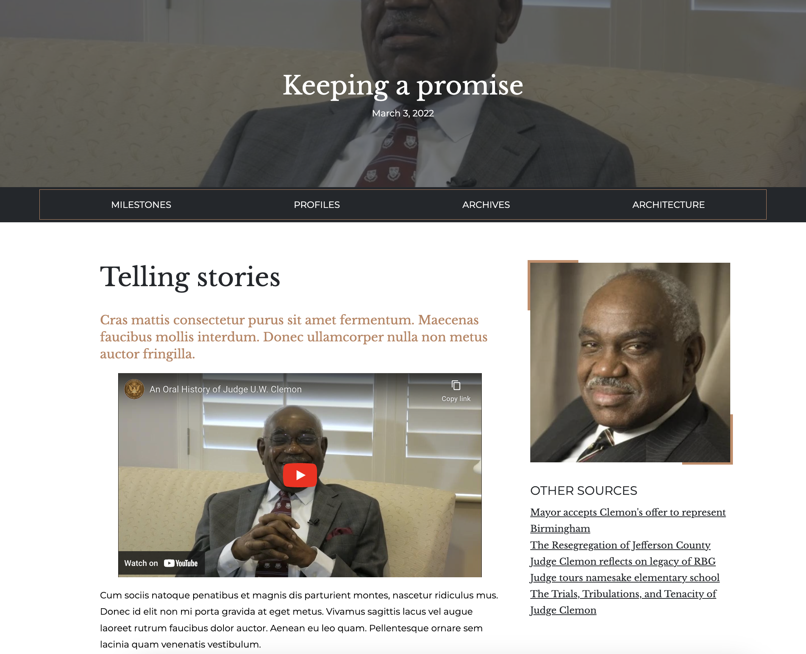

# Oral History, About Building, Events/Archives

This content type is one of the most custom in the entire site. Although it is a single content type, it generates content for various sections of the site depending on the page type selection during content creation.

<figure><figcaption>
Fig. 1
</figcaption></figure>

### Creating a new page

#### Page type and breaker

1. From your website's administrative toolbar (top of your site), click the **Content** link
2. Click the **Add content** button
3. Select **Oral History, About Building, Events/Archives**
4. Assign the page a **title**
5. Select from the 3 options for page type. **Important**: As of 2024, only **Oral Histories profiles** and **Events or Archives** are being actively used. Depending on your selection, the page you create will be placed in different sections of your site's hierarchy.
6. Add a **Cover** image to enhance the look of your page
7. Click the **Add component** to add a **Full breaker with subnav** component
8. Fillouot the breaker's fields as needed

#### Main content

1. Click the **Main content** tab in the edit screen
2. Click the **Add component** button
3. Select any of the available components as needed

#### Sidebar

1. Click the **Sidebar** tab in the edit screen
2. Similarly to the Main content section above, click the **Add component** button and add any components as needed.
3. Depending on your requirements, check the **Published** checkbox or uncheck it
4. Click the **Save** button

