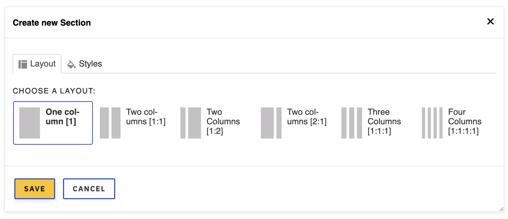
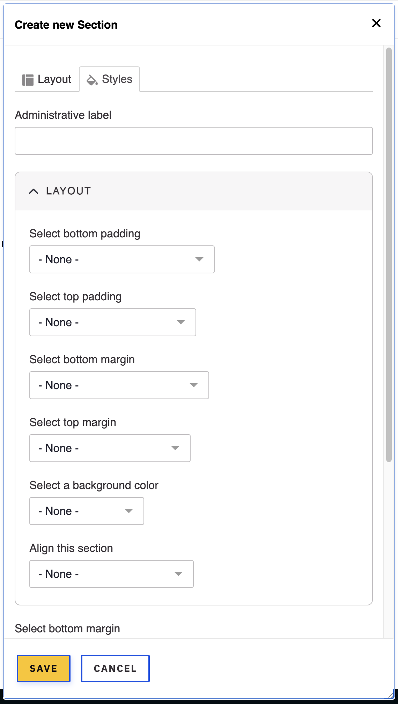

# Layout sections

Layout sections are the base of building any page. Think of sections as layouts with single or multiple columns. Your website's sections include the following column options:

* **One column**: A one column section can span the full width of the site or be restrained to specific width.
* **Two columns - 50/50**: Two equaly wide columns.
* **Two columns - 70/30**: With the left column twice as wide as the right column, this is a great option for creating most internal pages where you need a content section and a right sidebar.
* **Two columns - 30/70**: Similarly to the previous one but opposite placement of the columns.
* **Three columns**: Three equaly wide columns.
* **Four columns**: Four equaly wide columns.

_FIG. 1: Example of available layout sections._

## Using sections (required)

In almost every case when adding content to a page, a section should be added first to define the layout structure for the new content.
With sections, you can have a page with a mix of columns which provide flexibility to layout your content. If you look at the site's homepage you clearly see that the page was built by separating content in sections with various columns options.

### Adding a section

1. Navigate to the page where you need to add a component or content and edit the page
1. Once in the edit screen, click the **ADD SECTION** button. If you are adding the component in an existing section, skip the next step.
1. Choose from the list of section/layouts as shown in **FIG. 1** above. Each section's icon represents the columns distribution of that section as described at the very top of the paged.
1. Click **Save**. If this is a new page you may not see anything on the screen, but the section has been added.
1. Hover over the area where the section was added and click the _plus_ ( + ) sign. Each column in the section provides a _plus_ ( + ) sign where components/content can be added. After clicking the _plus_ sign you should be prompted withe a **Choose a component** dialog. Components are organized by their type of content (Text, Call to Action, Media, Lists, etc.).
1. Depending on the width of the column you are adding content into, the available components varies. For example, a Hero or Banner component should not be added on a narrow column.
1. Click the name of the component you wish to add into the section's column.
1. Fill out all the necessary fields for the component save your changes.
1. Then click the **Save** button at the top of the page followed by the **Done** button. This should display the newly added section and component on the page.

### Layout options

Each layout section provides a set of styles you can use to customize the section's width, background color, top/bottom margin and padding. See **FIG. 2** below:

_FIG. 2: Layout custom styles_.

## Editing a layout section

Layout sections can be edited if you wish to change the number of columns or any of the styles.

### Changing the number of columns or styles

1. Hover over the section are and you should see a **Section** button accompanied by a series of small icons.
1. Click the **pencil** icon and you will be prompted with the same dialog as to when you first added the section.
1. If you wish to change the number of columns, pick a different layout section. Depending on the difference between the original section you selected and the new one you wish to change it to, you may be prompted to choose where should the content that already exists in the section be transfered to. For example, if your original section had 3 columns, and you want to change it to 2 columns, you need to decide which column of the new section the content of the third column should go now that the third column will no longer exist.
1. If you wish to simply change some of the original styles you assigned to the section, click the **Styles** tab and make your changes.
1. Always save all the way by clicking **Save**, **Save**, and **Done**.

### Cloning a section

Let's say you are building a new page with lots of content and sections. Some of the content is similar in nature with minor differences such as an image or the words in the text. You can build a section exactly the way you want it, then clone it to use it for all other sections and simply make the changes needed. It's almost like creating a template and then reusing it. This is a time-saver.

1. Hover over the section are and you should see a **Section** button accompanied by a series of small icons.
1. Click the little icon that shows two tiny pages overlapping with each other. When you hover over the icon it reads "_Duplicate_". You will automatically get an exact copy of the original section.
1. You can now drag the cloned section up/down other sections.
1. **Tip**: When multiple sections exist on a page, you will see up/down carret icons. You can use these to move sections up/down without dragging.

### Deleting a section

Hovering over the Section displays the Section button with all the little icons. One of them is the icon of a trash can.

1. **Warning**: Clicking the little trash can icon will immediately delete the section.
1. **No worries**: Even if you deleted the section by clicking the trash can icon, you can still back out of this action by clicking the **Done** button at the top of the page or simply navigating out of the page without saving it.
