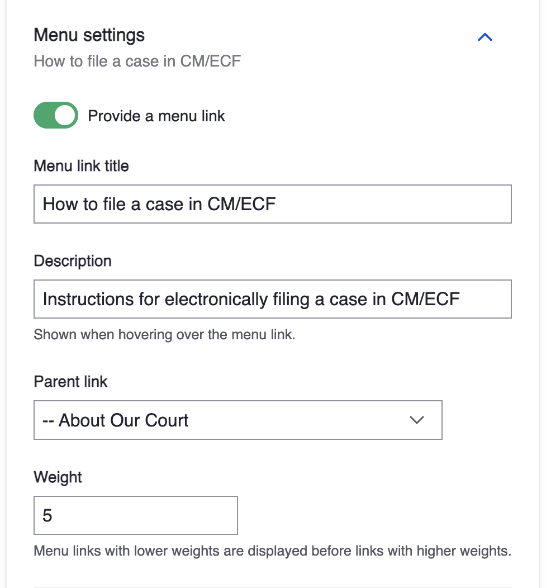

# Menus

In Drupal, menus are more than just simple links to other pages, they drive the site's content hierarchy as well as URLs and Breadcrumbs within pages.

## Working with menus

Menus can be managed in several ways in Drupal, you can manage them directly in the Menus page, or you can manage them as you create content.

1. From the Admin toolbar, click **Structure** then **Menus**. Here you will see several menus which make up each of the sections of the site.
2. Click the **Edit** link next to the menu you wish to edit. You should see all the links that are part of that particular menu. One thing you can do is change the order in which they display within that menu by dragging links to the order you wish to display them.
3. If you click **Edit** next to a link, you can change the label for the link as well as the url of the page the link goes to.
4. Within the Menu edit page you can also disable individual links by unchecking the **Enabled** checkbox
5. Save your changes.

### Adding links to a specific menu


 Learn best practices for creating [Internal and External links](../tasks/links.md).


1. Click **Structure** then **Menus**
1. Next to the menu you wish to add the link to, click **Edit menu**
1. Click the **Add link** button
1. Type a **Menu link title** for your link
1. In the **Link** field, start typing the title of the page you wish to link to. If link is to a page on a different website, type the full URL of that page.
1. Click **Save**
1. After the link has been added, you can change the order by dragging it from its crosshair toggle to the corresponding position
1. Click **Save** again.
1. Visit the menu where the new link was added to confirm it works as expected.

## Adding links to menus during content creation

Probably the most common way for adding links to menus is while you create content liks pages, news, alerts, jobs, etc.

1. From the admin toolbar, click **Content** then **Add content**.
1. Click **Page** as the type of content to create. Adding a menu link works the same for any type of content.
1. On the right sidebar of the Create page, scroll to the **Menu settings** section and expand it.
1. Toggle On the **Provide a menu link** toggle
1. By default, the _Menu link title_ will always be the title of the page. In most cases you should keep it this way.
1. The _Description_ is optional but it's a helpful hint for when you hover over the link.
1. Select the menu you wish to add the link to from the **Parent link**.
1. The weight determines the order in which the link will display within the menu. The higher the number, the lower it will be in the menu order (low weight = light, higher weight = heavier and drops tot he bottom.)
1. That's how a link is added to a menu during content creation.

_Adding a menu link while creating a page._
