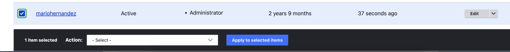

# Users

User management is one of Drupal's most robust and advanced features.

### Managing Users in Drupal

1. From Drupal's admin toolbar, click the **People** link
2. Click the **Add user** button
3. Fill out the **Email, Username,** and **Password** fields using a strong password
4. For **Status** select either **Active** or **Blocked** depending if this is an active user or you are creating the account for future use.&#x20;
5. For **Role** select the **Editor**. Editor is the designated role for anyone who simply needs to manage content, create new pages, create users. The Administrator role should not be used for these users.
6. Check the box if you wish to notify users about their new account.
7. Check the box to enforce password experiration policies. This is recommended because it forces users to change their password every 90 days.
8. Click the **Create new account** button.

### Updating users

1. While in the People page
2. Check the checkbox next to the user you wish to update. You should see the **Actions** diago which provides many actions you can take with the selected user.  See **Fig. 1** below.

<figure><figcaption>
Fig. 1
</figcaption></figure>

### Editing users

Sometimes you may need to edit users to do things like change their password, their role, or status.

1. While in the People page
2. Check the checkbox next to the user you wish to update
3. At the far right of the selected user, Click the **Edit** link
4. Make any adjustments you need to make and save your changes


**IMPORTANT**

For security reason, if an account is not being actively used, it's best to set it to **Blocked**.

