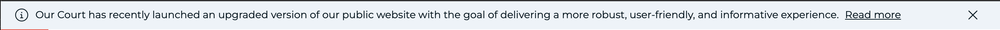
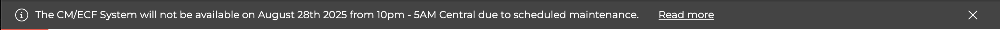
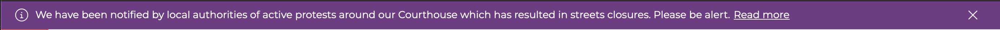

# Creating Alerts

Alerts are intended to display information, urgent messages, and or time sensitive messages to your website visitors. The alert is displayed at the very top of the website and they vary in color depending on the type of alert.

## Alerts types

**Information only alert** 🔔

This is the most common alert which is used simply to inform your website visitors of upcoming or non-urgent changes or updates. The updates could include local rules changes, closing of your organization due to upcoming federal holiday holiday, etc..

**High alert** ‼️

Use this alert type to inform visitors about a scheduled maintenance or unplanned downtime of a mission critical system such as CM/ECF, PACER, or others.

**Critical alert** 🚨

This type of alert is the most serious kind such as an active shooter scenario, pandemic or health related information, or perhaps streets or court closure due to police activity.

## Creating Alert messages


**NOTE**: Ensure you are logged in before proceeding.


1. From your website's administrative toolbar (top of your site), click the **Content** link.
2. Click the **Add content** button (far right on the screen).
3. Click **Alert** from the available content type options.
4. Type a descriptive title for the alert
5. Select the type of alert from the three options as described above (Informational, High, Critical).
6. If this is an alert you are creating to publish it immediately, toggle the **Activate alert** toggle button.


**IMPORTANT**: The **Summary** field information is what is displayed to visitors as the actual alert message.


1. Fill out the _Summary_ field but keep your message clear, short and avoid unnecessary words or phrases like "The United States District Court Middle District of Alabama". This simply adds to the lenght of the alert banner. _A good rule of thumb is to keep the summary message at a max of 140 characters so it looks presentable on mobile devices_.
2. **Body**: This is where you can really elaborate and be as detailed as possible about the alert you are posting. The Body information is what visitors see when the click the alert banner at the top of the website.
3. **Attqchements**: If you have supporting documents related to the alert you are posting, you can upload them as attachments.
4. **FAQs**: In some cases, you may anticipate questions might come up when people read the alert, for this reason, you can proactively add FAQs at the botom of the alert to answer any questions they may have.
5. **Published**: Alerts, like other types of content, are not published by default, if you want to publish the alert immediately, toggle the **Published** button at the top of the page.
6. Save your changes.

**Scheduling alerts** In some cases, the alerts you create can be written ahead of time and using the **Scheduling options** at the right of the page, you can set a day and time when the alert should be automatically published. This is very handy and releases some of the pressure of having to create alerts at the very last moment. Additionally, if you intend for an alert to only be visible for a given period of time, you can also schedule a day and time when the alert should automatically unpublished itself. How cool is that? 🙌
