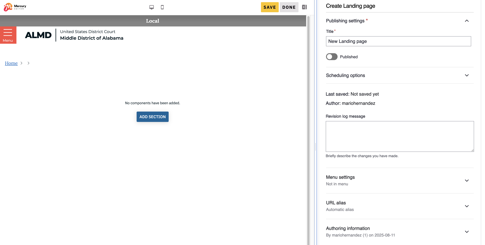
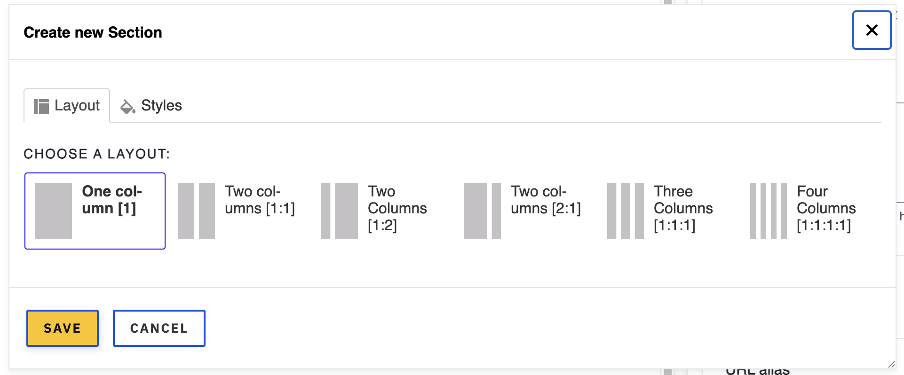
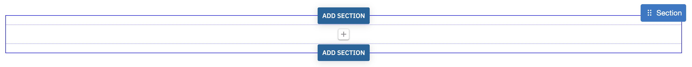
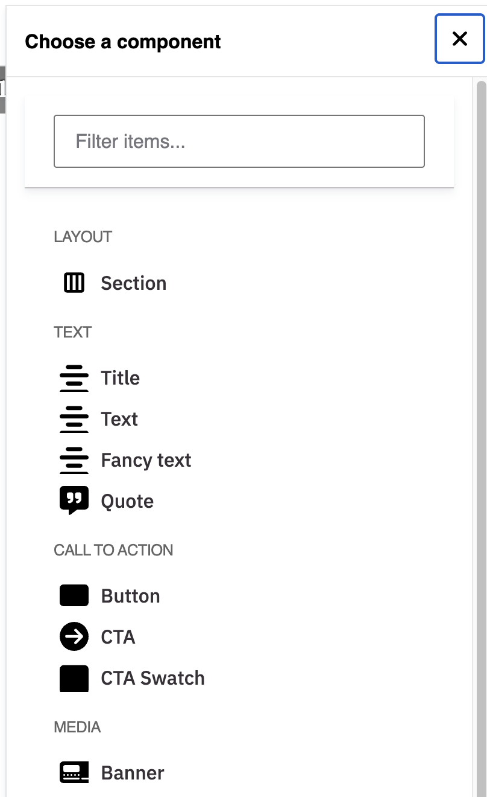

# Landing page

A landing page is a very important type of page. It serves as the main destination for a website's section. For example, if you click either _Home_, _For Attorneys_, _Judges_, _Clerk's Services, _Jurors_, or any of the main navigation's links, you will land on a "Landing page" (no pun intended).

It may seem intimidating and even too dificult to build, but as you will see, building a landing page is nothing more than breaking the page down into sections and decide what components or building blocks go into each section.

## Creating a landing page

1. From the top admin toolbar, click **Content**
1. Click the **Add content** button
1. Click **Landing page** from the available options. The page creation screen displays:

1. Type a title for the page, this is a required field.
1. The **Published** toggle makes it possible to build the page but not publish it. More like a draft for others to review and only publish it when approved.

In the middle of the page you will see the **ADD SECTION** button.
When you look at the full page prototype, you can clearly see horizontal divisions in the content structure. Each of these divisions is a section. Sections are recommended for more flexibility and creativity when building pages.

1. Click the **ADD SECTION** to add your first section. The _Choose new section_ dialog will appear.

_Sections offer one through four columns to present content in the best way possible._

1. Select **One column [1]** and click **Save**. At first it may appear as if nothing was added to the page but if you hover your mouse around the area white area of the page you should see a section grid as shown here:

Based on our prototype, we'll start with the Hero component. This is a component that is made up of several sub components: _Image, Title_ & _Links_.

1. In the new section we added, click the plus [ + ] button. The _Choose a component_ dialog will appear.

Each component in the list has been custom built to serve a purpose. The homepage prototype makes use of many components and we will learn about them as we add them.

1. Click the **Hero** component which you will find within the _Media_ group. The _Create new hero_ dialog displays.

1. Type a title for the Hero
1. Click the **Add media** button to select or upload an image. The image should be at least 1900px wide for better results.
1. Next we will add four links or Call to Actions (CTAs) as shown in the prototype.
1. For each link add a URL and Link text. Read about [how to properly add links](../tasks/links.md).
1. Click the **Add another CTA** button when you're ready to add another link.
1. Click **Save** to add the Hero to the page. You should see a preview of the new component.
1. Click the **Save** button at the top of the site, then click **Done** to close the edit screen. The page should reload and the Hero should be fully displayed on the page and should look like the hero in the prototype.
