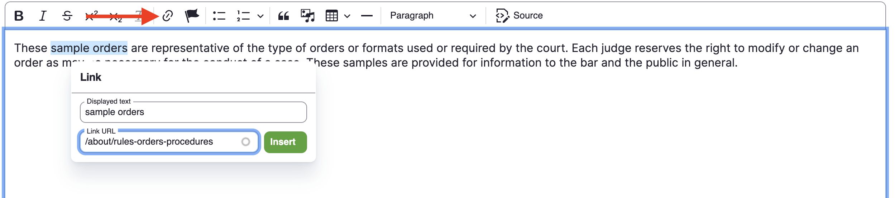
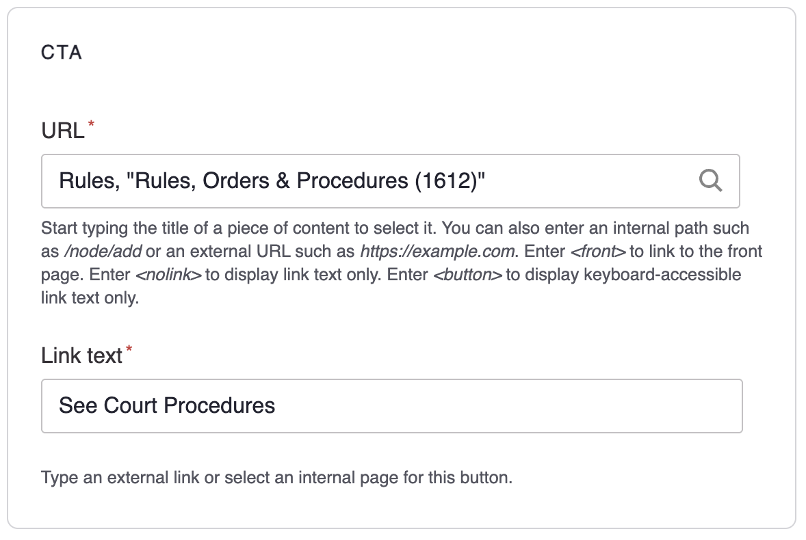
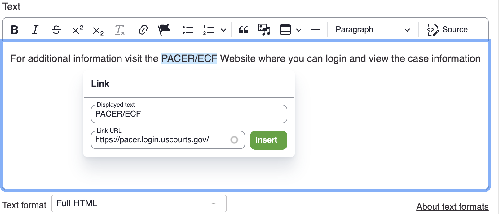

# Links

Probably one of the simples yet powerful elements of  a website. There are two types of links you will create: _Internal links_ and _External links_.

**Internal links**: Links to pages that exist in your website.

**External links**: Links to other websites or third party resources.

## Creating Internal links

Adding links will vary depending on whether you are adding them inside a component, page or menu.

**IMPORTANT**: For internal links, you supress the website's domain name and instead only type the page title.

🚫 `https://www.almd.uscourts.gov/clerks-services/electronic-filing`

✅ `/clerks-services/electronic-filing` or the page title. See below.

### Adding links in WYSIWYG editors

1. While logged in, edit a page that contains body text like a job post, alert, news, etc.
1. In a body/text field, highlight any part of the text you wisth to turn into a link.
1. With the text selected, click the **Link** icon from the editor's toolbar. You should see the Link dialog. See FIG. 1. below.
1. The text you selected should be in the **Displayed text** field.
1. For the **Link URL**, begin typing the title of the page you wish to link to. Several options will display as you type.
1. When you see your page, select it. The page's URL will be displayed allowing you to confirm it is the correct page.
1. Click the **Insert** button then save your changes.

_FIG. 1. Example of adding a link in a text editor._

### Addiing links in a component

1. Find a component that has a link and edit it. You should see a link section similar to FIG. 2. below
1. In the **URL** field, begin typing the title of the page you wish to link to. Several options will display as you type.
1. Select the link option that matches the page. The URL info should change to the page's title with a numeric value in parenthesis which represent the page id.
1. In the **Link text** field, type the desired text for your link (i.e. Learn more about us, Read the full article, etc.)
1. Click **Save** and save all your changes.

_FIG. 2. Example of adding a link in a component._

## Creating External links

Creating external links is similar to creating internal links. The only difference is that in the URL field you type or paste the full website address you want to link to. See FIG. 3.

_FIG. 2. Example of adding an external link._

**IMPORTANT**: The full URL of a page/website should only be used for external links.
