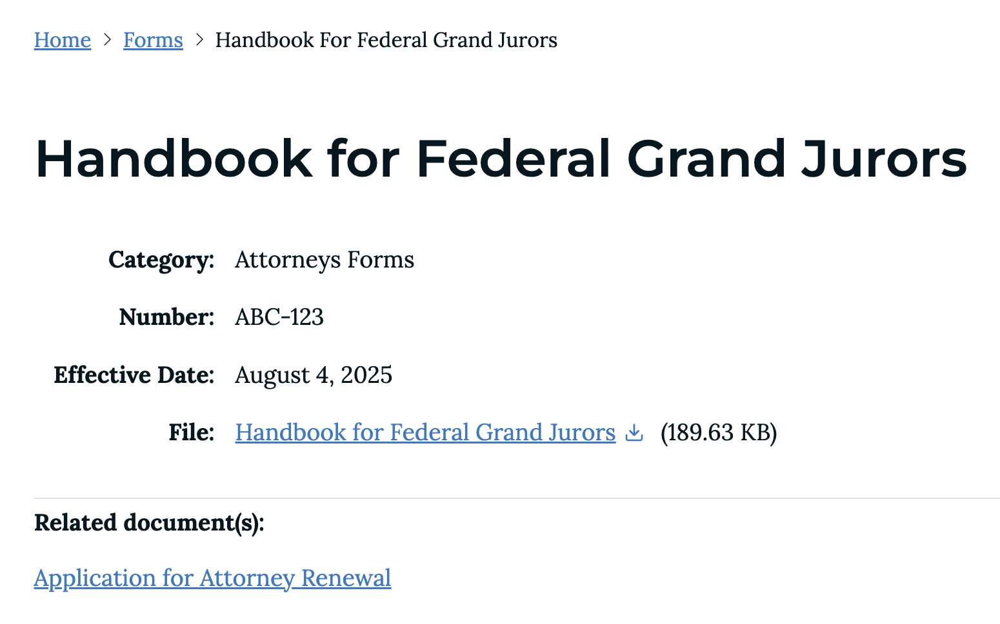

# Forms, Documents & General Orders

In Drupal, any type of file whether it is an image, audio, video, or document, is considered "Media". For files of any type, **only PDF format is allowed**.

The process for adding forms, documents and General orders is similar with minor differences depending on the type of document. For example, a form may have a form number or effective date whereas a plain document probably does not.


**Naming Files**:
Naming documents should be done using a consistent methodology.  This will result in visitors having a good user experience when viewing and downloading your documents.  Here are some basic guidelines for naming document files:

* ✅ Use hyphens instead of underscores for separating words. (Hypens are easier to read in URLs)
* ✅ Preferably, only use lower case characters.
* 🚫 Avoid using spaces to separate words.
* 🚫 Avoid using non-alpha/numeric characters like '$, %, &, @, #, ?, ()'. If you are provided with a document with these characters, remove them or replace them with a hyphens.

🚫 _Handbook of%20;Federal\_(Grand) Juror.PDF_

🚫 _HANDBOOK FOR FEDERAL GRAND JURORS.PDF_

✅ _handbook-for-federal-grand-jurors.pdf_

✅ _HandbookForFederalGrandJurors.pdf_ (this is also a valid name as it is easy to read).


**What if the Judge wants me to use a specific name?**
No problem, you will be able to use any name you wish while still keeping the file name friendly. More on this later.

## Adding a document (Form, Document or General Order)

_The document in these instructions is for demo purposes only. Some information used is not real_.

1. From the admin toolbar at the top of the site, hover over or click **Content** > **Media** > **Add media** > **Form**. The _Add form_ entry form will be displayed.
**Note**: If you are adding an external form that is on someone else's website, skip to **Step 9**.
1. Type the name of the form. Here you can use the name the Judge wishes to use. This name should be grammatically correct as you would normally type it in an email or document you are writing (i.e. _Handbook for Federal Grand Jurors_).
1. Select one or multiple categories for the form. This helps sort forms by their category.
1. Click the **Choose file** button to upload the PDF file and browse to where you have saved the file. Max file size is 20 MB.
1. After the file has been uploaded, fill out the **Description** field directly under the file. (**Tip**: Copy the text from the Name field into the Description field). The description is used as the link to the document.
1. If applicable provide a form number.
1. If applicable select the date this form or document takes or took effect.
1. If there are other documents or forms you would like to associate with this one, click the **Add media** button under **Related document(s)**. Then you can select as many items from the library as needed, or you can upload new ones. This allows those viewing forms have quick access to other related documents.
1. If this is a form that is not available in your website but some other website, you could instead provide the link text (name of the form), and the URL where it can be downloaded (i.e. `www.uscourts.gov/forms/form-name`).
1. Save your changes. You should see the new form/document at the top of the media items table.
1. Clicking the new document should show you a full view of it with all the information you provided.
Pay close attention to the value of **File** in the screenshot below. The name is the grammatically correct name while the PDF file name was set as `handbook-for-federal-grand-jurors.pdf`. Using this file name allows us to have a friendly url: `https://www.almd.uscourts.gov/sites/default/files/documents/forms/2025-08/handbook-federal-grand-jurors.pdf`.

---

_Example of a form displayed in full view mode._
