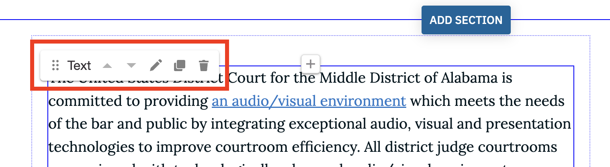

# Edit a page

Whether you want to change a word, a sentence, a full pagraph or add an image to a page, the editing process is pretty straight forward but it does vary depending on the type of page you are trying to edit.

To keep things simple, we will edit a typical page to modify some of its content. The page we'll edit is "_Technology and Training_".

1. Login to the website
1. Find the page you want to edit. You can do this by clicking the **Content** link in the admin toolbar at the top, then search for the page you need to edit.
1. With the target page on display, click the **Edit Technology and Training** link located directly above the website's logo.

This particular page is structured as a two-column page where the left side is the main content and the right side is a narrow sidebar for supporting information.

If you hover over the main content area, you will see some kind of grid or outline show. You will also notice a floating control called **Text** with small icons. See Fig. 1 below.

1. The **Text** control is a custom built component which allow you to use it on any page to add full HTML text content.
1. Click the little **Pencil** icon to edit the Text component. You should see the Text editor open up allowing you to delete, edit or add content.
1. After you are done making your changes, click the **Save** button. Your changes will be saved but you are still in edit mode.
1. Click the **Save** button at the top of the page, then click the **Done** button. This completes the editing process.
